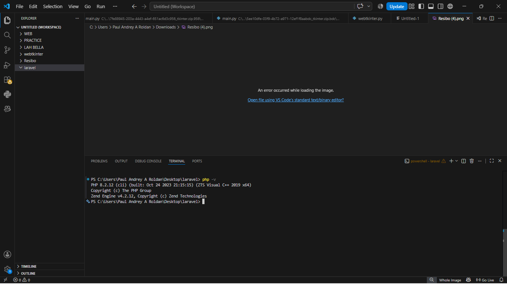
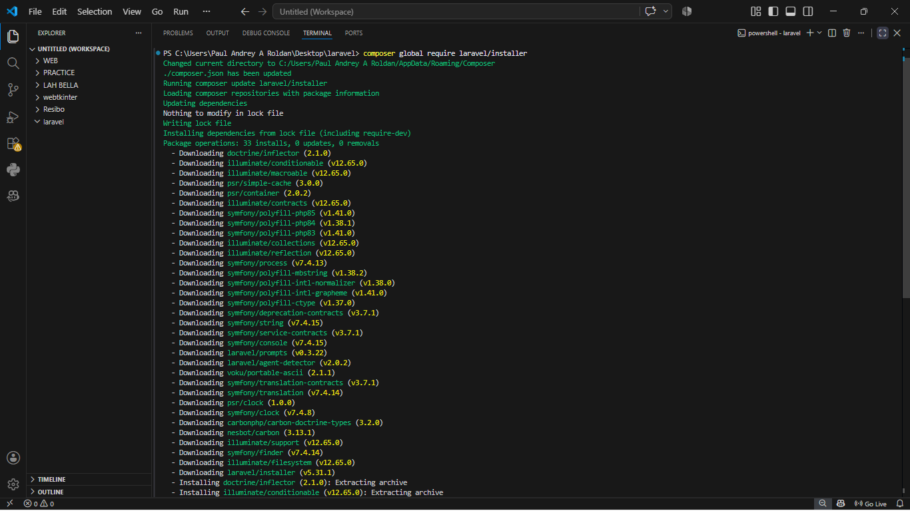
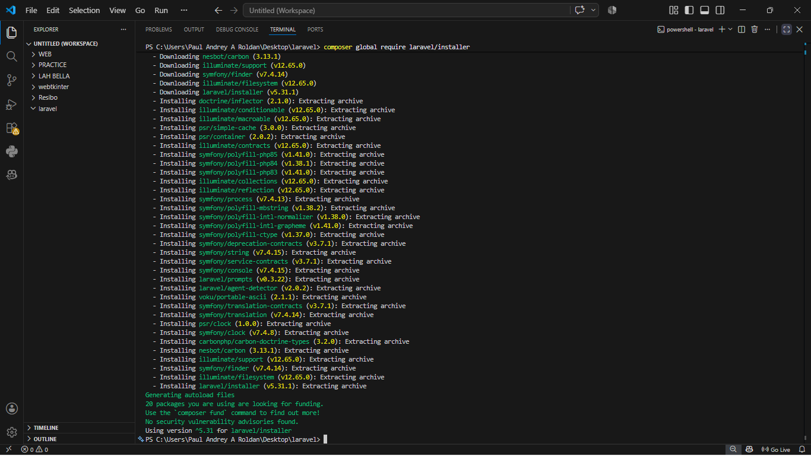
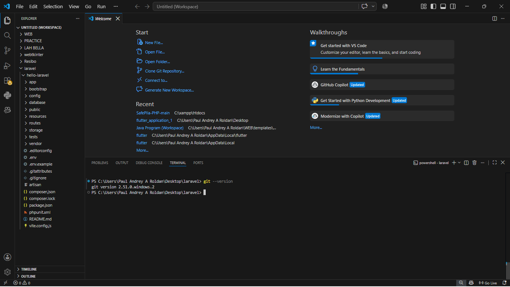
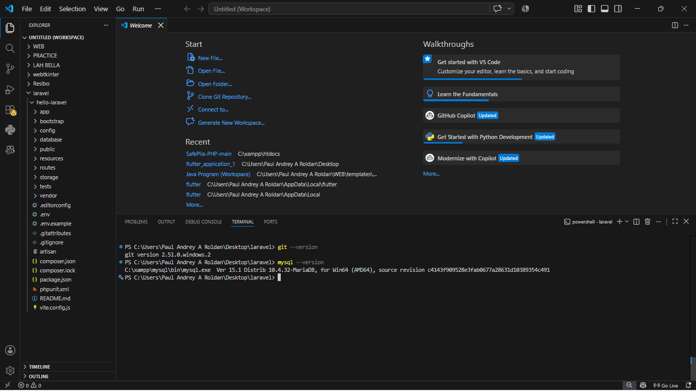
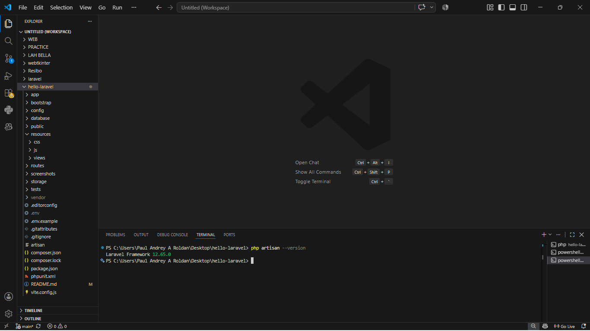
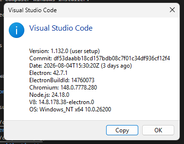
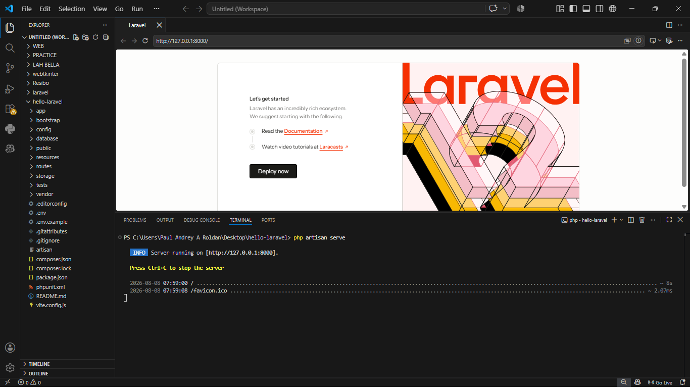
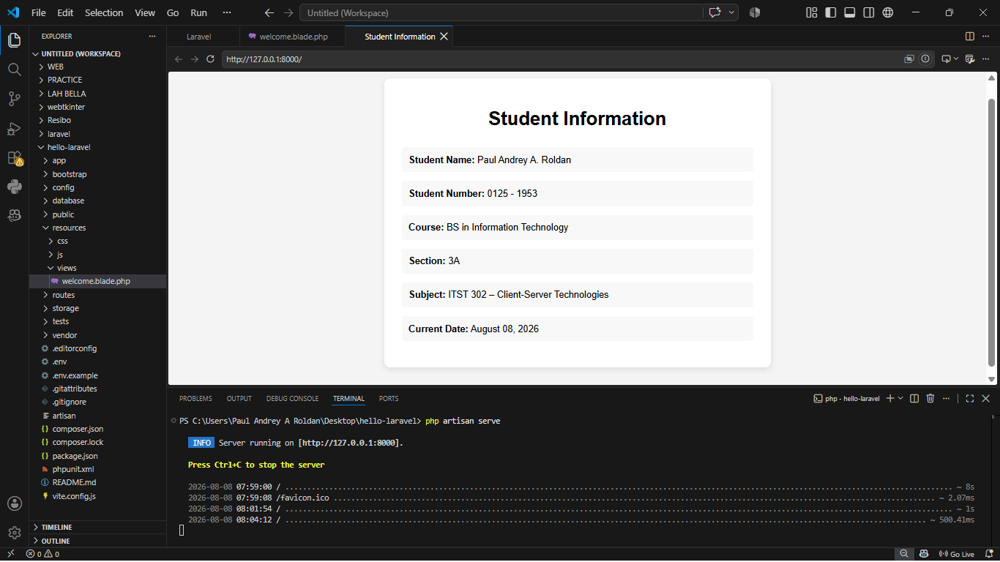

# Client-Server Week 02 - Laravel Setup

## 1. Project Title

**Client-Server Week 02 - Laravel Setup**

---

## 2. Introduction

### Overview of Laravel

Laravel is a PHP web application framework designed to simplify the development of modern web applications. It provides useful features and tools for organizing application code, handling routes, managing databases, and creating dynamic web pages.

### Importance of Client-Server Technologies

Client-server technologies are important in modern software development because they allow users to interact with applications through a client while application processing and data management are handled by a server. This architecture is commonly used in websites and web-based systems that require communication between users, applications, and databases.

### Purpose of the Project

The purpose of this project is to set up a Laravel development environment and create a basic Laravel project. The activity also aims to familiarize the student with PHP, Composer, Laravel, MySQL, Git, Visual Studio Code, and basic Laravel project structure.

---

## 3. Objectives

At the end of the activity, the following objectives were achieved:

1. Install and configure PHP for Laravel development.
2. Install and verify Composer as PHP's dependency manager.
3. Install the Laravel installer.
4. Create a new Laravel project using Composer.
5. Run a Laravel application using the Laravel development server.
6. Modify the default Laravel homepage.
7. Document the Laravel project and development environment.
8. Prepare the project for version control using Git and GitHub.

---

## 4. Development Environment

The following tools and software were used during the activity:

| Component | Version |
|---|---|
| Operating System | Windows |
| PHP | 8.2.12 |
| Laravel | [ENTER YOUR LARAVEL VERSION] |
| Composer | 2.10.2 |
| Git | [ENTER YOUR GIT VERSION] |
| MySQL | [ENTER YOUR MYSQL VERSION] |
| Visual Studio Code | [ENTER YOUR VS CODE VERSION] |

### Commands Used to Verify Versions

| Component | Verification Command |
|---|---|
| PHP | `php -v` |
| Composer | `composer -V` |
| Laravel | `laravel -V` |
| Git | `git --version` |
| MySQL | `mysql --version` |
| Visual Studio Code | `code --version` |

---

## 5. Installation Steps

### Step 1: Install PHP

PHP was installed through XAMPP. The PHP executable was located at:

`C:\xampp\php\php.exe`

The PHP directory was added to the Windows PATH so that PHP could be accessed from PowerShell and the Visual Studio Code terminal.

The installation was verified using:

`php -v`

The installed PHP version was PHP 8.2.12.

**Screenshot 1 - PHP Version Verification**

This screenshot shows PHP successfully recognized by the terminal.


**Figure 1 PHP version verification**

---

### Step 2: Install Composer

Composer was installed using the Composer Windows installer.

During installation, the PHP executable from XAMPP was selected:

`C:\xampp\php\php.exe`

After installation, Composer was verified using:

`composer -V`

The installed Composer version was Composer 2.10.2.

**Screenshot 2 - Composer Version Verification**

This screenshot shows Composer successfully installed and recognized by the terminal.


**Figure 2.1 Composer version verification**

**Figure 2.2 Composer version verification**

---

### Step 3 — Verify Git Installation

Git was installed and verified using:

```powershell
git --version
```

The command confirmed that Git 2.55.0 was installed.



**Figure 3. Git version verification**

---

### Step 4 — Verify MySQL Installation

MySQL was installed and verified using:

```powershell
mysql --version
```

The command confirmed that MySQL Community Server 8.0.43 was installed.



**Figure 4. MySQL version verification**

---

### Step 5 — Verify Laravel Installation

After creating the Laravel project, the Laravel version was verified from inside the project directory.

The following command was used:

```powershell
php artisan --version
```

The command confirmed that the project was using Laravel Framework 13.24.0.



**Figure 5. Laravel version verification**

---

### Step 6 — Verify Visual Studio Code

Visual Studio Code was used as the primary development environment for the project. Its version information was checked through the application's About information.



**Figure 6. Visual Studio Code version information**

---

### Step 7 — Create the Laravel Project

The Laravel project was created using Composer.

The following command was executed:

```powershell
composer create-project laravel/laravel hello-laravel
```

This created a new Laravel project named `hello-laravel`.

The project was then opened in Visual Studio Code for development.

---

### Step 8 — Configure the Laravel Application

After the Laravel project was created, the application encryption key was generated using:

```powershell
php artisan key:generate
```

This generated the application key required by Laravel for encryption-related operations.

The Laravel environment and configuration files were also checked to make sure that the application could run correctly.

---

### Step 9 — Configure the Database

The Laravel project initially used SQLite as its configured database connection.

When Laravel reported that the SQLite database file did not exist, the required database file was created using:

```powershell
New-Item database\database.sqlite -ItemType File
```

The required SQLite PHP extensions were then enabled in the PHP configuration.

After the configuration was corrected, the database migrations were executed using:

```powershell
php artisan migrate
```

This initialized the required Laravel database tables.

---

### Step 10 — Run the Laravel Development Server

The Laravel development server was started using:

```powershell
php artisan serve
```

Laravel started the local development server at:

```text
http://127.0.0.1:8000
```



**Figure 7. Laravel development server running**

The local application was then accessed through the browser using the development server address.

---

### Step 11 — Customize the Laravel Homepage

The default Laravel homepage was customized by editing:

```text
resources/views/welcome.blade.php
```

The homepage was modified to display information related to the Client-Server Technologies activity.

The customized homepage contains a welcome message, student and subject information, and a footer.



**Figure 8. Customized Laravel homepage**

---

### Step 12 — Track the Project Using Git

Git was initialized and configured for the Laravel project.

The main branch was named `main` using:

```powershell
git branch -M main
```

The Laravel project files were then staged:

```powershell
git add .
```

The initial Laravel project was committed using:

```powershell
git commit -m "feat: initialize Laravel project"
```

The screenshots were then added and committed using:

```powershell
git add screenshots
git commit -m "docs: add setup screenshots"
```

Finally, the customized Laravel homepage was committed using:

```powershell
git add resources/views/welcome.blade.php
git commit -m "feat: customize Laravel homepage"
```

The project therefore contains a Git history documenting the major stages of the activity.

---

## 6. Project Structure

Laravel uses a structured directory organization. Each directory has a specific purpose within the application.

### `app/`

The `app/` directory contains the core application code. It includes models, controllers, and service providers used by the Laravel application.

### `routes/`

The `routes/` directory contains the application's route definitions.

The main web routes are defined in:

```text
routes/web.php
```

This file determines how web requests are handled by the application.

### `resources/`

The `resources/` directory contains frontend resources such as Blade views, CSS, and JavaScript files.

The customized homepage created during this activity is located at:

```text
resources/views/welcome.blade.php
```

### `public/`

The `public/` directory contains publicly accessible files used by the Laravel application. It also contains the main entry point of the application.

### `config/`

The `config/` directory contains configuration files for different parts of Laravel, including application settings, database configuration, cache, mail, queue, session, and filesystem settings.

### `database/`

The `database/` directory contains database-related files such as migrations, factories, seeders, and the SQLite database file used by the project.

---

## 7. Problems Encountered

### Problem 1: PHP Was Not Recognized

Initially, running `php -v` resulted in an error stating that PHP was not recognized as a command.

This happened because the PHP executable was not yet available through the Windows PATH.

### Problem 2: Composer Was Not Recognized

Before Composer was installed, running `composer -V` resulted in an error stating that Composer was not recognized as a command.

### Problem 3: Laravel Installer Could Not Download Packages

While installing the Laravel installer, Composer displayed an error stating:

"The zip extension and unzip/7z commands are both missing."

Composer also indicated that the PHP configuration file being used was:

`C:\xampp\php\php.ini`

### Problem 4: MySQL Was Not Recognized

Running `mysql --version` resulted in an error stating that MySQL was not recognized as a command.

Although MySQL was already installed through XAMPP, its executable directory was not yet available through the PATH.

### Problem 5: Laravel Could Not Find the artisan File

When `php artisan serve` was executed from the parent `laravel` directory, the following error occurred:

"Could not open input file: artisan"

The problem occurred because the terminal was not inside the actual Laravel project directory.

---

## 8. Solutions

### Solution to Problem 1: PHP PATH

PHP was already installed through XAMPP. The PHP directory was added to the Windows PATH:

`C:\xampp\php`

After reopening the terminal, the `php -v` command successfully displayed the PHP version.

### Solution to Problem 2: Composer Installation

Composer was installed using the Composer Windows installer.

During installation, the PHP executable from XAMPP was selected:

`C:\xampp\php\php.exe`

After installation, Composer was successfully recognized using:

`composer -V`

### Solution to Problem 3: PHP ZIP Extension

The PHP configuration file being used by the command-line PHP was identified using:

`php -i | findstr /i "Loaded Configuration File"`

The result showed:

`Loaded Configuration File => C:\xampp\php\php.ini`

The ZIP extension was enabled in the PHP configuration file.

The extension was then checked using:

`php -m | findstr /i zip`

### Solution to Problem 4: MySQL PATH

MySQL was already installed through XAMPP. The executable was located at:

`C:\xampp\mysql\bin\mysql.exe`

The MySQL directory was added to the Windows PATH:

`C:\xampp\mysql\bin`

The installation was then verified using:

`mysql --version`

### Solution to Problem 5: Incorrect Laravel Directory

The `artisan` file was located inside the `hello-laravel` Laravel project.

The terminal was changed to the correct project directory using:

`cd hello-laravel`

After entering the correct directory, the Laravel development server was successfully started using:

`php artisan serve`

---

## 9. Screenshots

The following screenshots provide visual evidence of the development environment setup and the completed Laravel application.

### Screenshot 1 — PHP Version

This screenshot shows the PHP version installed and available through the command line.


---

### Screenshot 2 — Composer Version

This screenshot shows the Composer version installed for PHP dependency management.


---

### Screenshot 3 — Laravel Version

This screenshot confirms the Laravel Framework version used by the project.


---

### Screenshot 4 — Git Version

This screenshot shows the installed Git version used for version control.


---

### Screenshot 5 — MySQL Version

This screenshot confirms that MySQL Community Server 8.0.43 was installed successfully.


---

### Screenshot 6 — Visual Studio Code

This screenshot provides evidence of the Visual Studio Code development environment used for the project.


---

### Screenshot 7 — Laravel Development Server

This screenshot shows the Laravel development server running through `php artisan serve`.


---

### Screenshot 8 — Customized Laravel Homepage

This screenshot shows the completed Laravel homepage after modifying the default Blade view.


---

## 10. Reflection

This activity helped me understand the process of setting up a Laravel development environment and how the different tools used in client-server development work together. I learned that PHP is the programming language required by Laravel, while Composer is used to manage PHP packages and dependencies. I also learned how XAMPP can provide PHP and MySQL for local development and how Visual Studio Code can be used to manage and develop a Laravel project.

One of the challenges I encountered was that PHP was initially not recognized when I entered the `php -v` command in PowerShell. I learned that a program can already be installed on a computer but still cannot be accessed through the terminal if its directory has not been added to the system PATH. I experienced a similar problem with MySQL, which helped me understand the importance of properly configuring environment variables.

Another challenge happened while installing the Laravel installer. Composer reported that the ZIP extension and unzip/7z commands were missing. I learned how to determine which `php.ini` configuration file was being used by the command-line PHP and how PHP extensions can affect Composer and Laravel installation. This experience showed me that troubleshooting installation errors often requires checking the configuration of the development environment instead of immediately reinstalling the software.

I also encountered an issue when running `php artisan serve`. The terminal returned an error saying that it could not open the `artisan` file. I learned that Laravel commands need to be executed from the actual Laravel project directory because the `artisan` file is located there.

Laravel is important in client-server development because it provides a structured framework for developing web applications. It organizes important parts of an application such as routes, application logic, views, configuration, and database components. This structure makes applications easier to develop, maintain, and expand.

The knowledge I gained from this activity will be useful in future software development projects because I now have practical experience setting up a development environment, managing dependencies, creating a Laravel application, troubleshooting configuration problems, and running a web application locally. I can also use these skills when working with databases, Git, GitHub, and larger client-server applications in future projects.

---

## 11. References

Laravel. (n.d.). *Laravel documentation*. https://laravel.com/docs

PHP Documentation Group. (n.d.). *PHP manual*. https://www.php.net/docs.php

Composer. (n.d.). *Composer documentation*. https://getcomposer.org/doc/

Git. (n.d.). *Git documentation*. https://git-scm.com/doc

Microsoft. (n.d.). *Visual Studio Code documentation*. https://code.visualstudio.com/docs